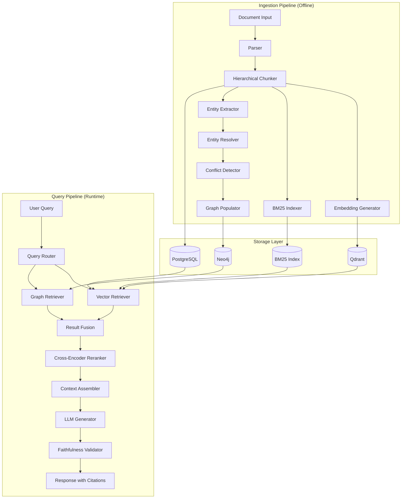

# Design Document: Graph RAG Layer for Banking Documents

## Overview

The Graph RAG Layer is a hybrid retrieval system that combines vector-based semantic search with knowledge graph traversal to answer complex queries about banking Functional Specification Documents (FSDs). The system architecture follows a two-pipeline approach:

1. **Ingestion Pipeline (Offline)**: Processes documents through parsing, chunking, embedding, entity extraction, and graph population
2. **Query Pipeline (Runtime)**: Routes queries to appropriate retrieval modes, fuses results, and generates grounded responses

The design leverages four storage layers working in concert:
- **Qdrant**: Vector embeddings for semantic similarity search
- **BM25 Index**: Keyword-based search for acronyms and exact terms
- **PostgreSQL**: Full text storage with metadata
- **Neo4j**: Knowledge graph for entity relationships

Key architectural principles:
- **Separation of concerns**: Ingestion and query pipelines are independent
- **Pluggable retrieval**: Vector, graph, and hybrid modes can operate independently
- **Grounded generation**: All LLM responses must cite source documents
- **Incremental processing**: Documents can be ingested individually without reprocessing the entire corpus

## Architecture

### System Components



### Data Flow

**Ingestion Flow**:
1. Document (.docx/.pdf) → Parser → Structured text with metadata
2. Structured text → Chunker → Parent chunks + Child chunks with breadcrumbs
3. Chunks → Embedding Generator → Vector embeddings → Qdrant
4. Chunks → BM25 Indexer → Term frequencies → BM25 Index
5. Chunks → PostgreSQL (full text + metadata)
6. Chunks → Entity Extractor → Entities (spaCy NER + LLM)
7. Entities → Entity Resolver → Deduplicated canonical entities
8. Entities → Conflict Detector → CONFLICTS_WITH relationships
9. Entities + Relationships → Neo4j Knowledge Graph

**Query Flow**:
1. User query → Query Router → Mode classification (VECTOR/GRAPH/HYBRID)
2. Mode → Retrieval (parallel for HYBRID)
   - Vector: Query embedding → Qdrant similarity search + BM25 keyword search
   - Graph: Entity extraction → Cypher query → Neo4j traversal
3. Results → Fusion (deduplication + merging)
4. Fused results → Cross-Encoder → Reranked top-k
5. Top-k → Context Assembler → Structured context with citations
6. Context + Query → LLM → Generated response
7. Response → Faithfulness Validator → Validated response with score

## Components and Interfaces

### 1. Document Parser

**Purpose**: Extract text and structure from .docx and .pdf files

**Interface**:
```python
class DocumentParser:
    def parse(self, file_path: str, file_type: str) -> ParsedDocument:
        """
        Parse document and extract structured content
        
        Args:
            file_path: Path to document file
            file_type: 'docx' or 'pdf'
            
        Returns:
            ParsedDocument with text, sections, metadata
            
        Raises:
            ParsingError: If document cannot be parsed
        """
```

**Implementation Details**:
- Use `python-docx` for .docx parsing
- Use `PyPDF2` or `pdfplumber` for .pdf parsing
- Extract document structure: title, sections, headings, page numbers
- Preserve formatting metadata (bold, italics) for entity extraction hints
- Handle malformed documents gracefully with error messages

**Data Structures**:
```python
@dataclass
class ParsedDocument:
    doc_id: str
    title: str
    sections: List[Section]
    metadata: Dict[str, Any]

@dataclass
class Section:
    section_id: str
    heading: str
    level: int  # Heading level (1, 2, 3...)
    text: str
    page_numbers: List[int]
```

### 2. Hierarchical Chunker

**Purpose**: Split documents into parent and child chunks with contextual breadcrumbs

**Interface**:
```python
class HierarchicalChunker:
    def __init__(self, parent_size: int = 2048, child_size: int = 512):
        """
        Initialize chunker with size limits
        
        Args:
            parent_size: Max tokens for parent chunks (section-level)
            child_size: Max tokens for child chunks
        """
    
    def chunk(self, document: ParsedDocument) -> List[Chunk]:
        """
        Create hierarchical chunks with breadcrumbs
        
        Returns:
            List of Chunk objects (both parent and child)
        """
```

**Implementation Details**:
- Parent chunks: Represent major sections, up to 2048 tokens
- Child chunks: Split from parents, max 512 tokens, preserve sentence boundaries
- Breadcrumbs: Document title → Section → Subsection path
- Overlap: 50 tokens between adjacent child chunks for context continuity
- Token counting: Use tiktoken with model-specific encoding

**Data Structures**:
```python
@dataclass
class Chunk:
    chunk_id: str
    doc_id: str
    text: str
    chunk_type: str  # 'parent' or 'child'
    parent_chunk_id: Optional[str]
    breadcrumbs: str  # "Doc Title > Section > Subsection"
    section: str
    token_count: int
    metadata: Dict[str, Any]
```

**Chunking Strategy**:
- Respect document structure (don't split mid-section)
- Preserve tables and lists as atomic units
- Include section headings in chunk text for context

### 3. Embedding Generator

**Purpose**: Generate vector embeddings for semantic search

**Interface**:
```python
class EmbeddingGenerator:
    def __init__(self, model_name: str = "sentence-transformers/all-MiniLM-L6-v2"):
        """Initialize with embedding model"""
    
    def generate(self, text: str) -> np.ndarray:
        """Generate embedding vector for text"""
    
    def batch_generate(self, texts: List[str]) -> np.ndarray:
        """Generate embeddings for multiple texts efficiently"""
```

**Implementation Details**:
- Use sentence-transformers for embedding generation
- Model: `all-MiniLM-L6-v2` (384 dimensions, good balance of speed/quality)
- Batch processing: Process 32 chunks at a time for efficiency
- Normalization: L2-normalize embeddings for cosine similarity
- Caching: Cache embeddings to avoid recomputation

**Storage in Qdrant**:
```python
# Qdrant point structure
{
    "id": chunk_id,
    "vector": embedding,
    "payload": {
        "doc_id": str,
        "chunk_id": str,
        "text": str,
        "breadcrumbs": str,
        "section": str,
        "chunk_type": str
    }
}
```

### 4. BM25 Indexer

**Purpose**: Build keyword-based search index for exact term matching

**Interface**:
```python
class BM25Indexer:
    def __init__(self, k1: float = 1.5, b: float = 0.75):
        """
        Initialize BM25 with parameters
        
        Args:
            k1: Term frequency saturation parameter
            b: Length normalization parameter
        """
    
    def index(self, chunks: List[Chunk]) -> None:
        """Build BM25 index from chunks"""
    
    def search(self, query: str, top_k: int = 10) -> List[Tuple[str, float]]:
        """
        Search index and return chunk IDs with scores
        
        Returns:
            List of (chunk_id, bm25_score) tuples
        """
```

**Implementation Details**:
- Use `rank_bm25` library for implementation
- Tokenization: Lowercase, remove punctuation, split on whitespace
- Preserve acronyms: Don't split "NEFT" or "RTGS"
- Index both chunk text and breadcrumbs for context matching
- Update incrementally: Support adding new documents without full reindex

### 5. Entity Extractor

**Purpose**: Extract domain entities from chunks using NER and LLM

**Interface**:
```python
class EntityExtractor:
    def __init__(self, spacy_model: str = "en_core_web_sm", llm_client: LLMClient):
        """Initialize with spaCy model and LLM client"""
    
    def extract(self, chunk: Chunk) -> List[Entity]:
        """
        Extract entities from chunk text
        
        Returns:
            List of Entity objects with type, text, and context
        """
```

**Implementation Details**:
- **Stage 1 - spaCy NER**: Extract standard entities (ORG, PRODUCT, MONEY, DATE)
- **Stage 2 - LLM Extraction**: Extract domain-specific entities using prompted LLM
  - Entity types: System, PaymentMode, Workflow, Rule, Field
  - Prompt template: "Extract banking entities from: {text}. Return JSON: [{type, name, context}]"
- **Normalization**: Convert to canonical forms (e.g., "NEFT system" → "NEFT")
- **Context preservation**: Store surrounding text for disambiguation

**LLM Prompt for Entity Extraction**:
```
You are extracting entities from banking documentation.

Entity types:
- System: Banking systems or applications (e.g., "NEFT", "Core Banking")
- PaymentMode: Payment methods (e.g., "RTGS", "IMPS", "UPI")
- Workflow: Business processes (e.g., "Payment Authorization Flow")
- Rule: Business rules or policies (e.g., "Transaction Limit Rule")
- Field: Data fields or attributes (e.g., "Account Number", "IFSC Code")

Text: {chunk_text}

Extract all entities as JSON array:
[{"type": "System", "name": "NEFT", "context": "..."}]
```

**Data Structures**:
```python
@dataclass
class Entity:
    entity_id: str
    entity_type: str  # System, PaymentMode, Workflow, Rule, Field
    name: str
    canonical_name: str  # Normalized form
    source_chunk_id: str
    context: str  # Surrounding text
    properties: Dict[str, Any]
```

### 6. Entity Resolver

**Purpose**: Deduplicate entities across chunks and create canonical nodes

**Interface**:
```python
class EntityResolver:
    def __init__(self, similarity_threshold: float = 0.85):
        """Initialize with similarity threshold for matching"""
    
    def resolve(self, entities: List[Entity]) -> Tuple[List[Entity], List[Relationship]]:
        """
        Deduplicate entities and create SAME_AS relationships
        
        Returns:
            Tuple of (canonical_entities, same_as_relationships)
        """
```

**Implementation Details**:
- **Similarity Matching**: Use string similarity (Levenshtein distance) and embedding similarity
- **Clustering**: Group similar entities using DBSCAN clustering
- **Canonical Selection**: Choose most frequent or most complete entity as canonical
- **SAME_AS Relationships**: Link all mentions to canonical entity
- **Incremental Resolution**: Support adding new entities without full reprocessing

**Resolution Algorithm**:
1. Compute pairwise similarity between all entities of same type
2. Build similarity graph with edges where similarity > threshold
3. Find connected components (clusters of similar entities)
4. For each cluster, select canonical entity (most mentions or longest name)
5. Create SAME_AS edges from all cluster members to canonical

**Example**:
```
Entities: ["NEFT", "NEFT System", "National Electronic Funds Transfer"]
→ Canonical: "NEFT"
→ SAME_AS edges: "NEFT System" → "NEFT", "National Electronic Funds Transfer" → "NEFT"
```

### 7. Conflict Detector

**Purpose**: Identify contradictory information and create CONFLICTS_WITH relationships

**Interface**:
```python
class ConflictDetector:
    def __init__(self, llm_client: LLMClient):
        """Initialize with LLM client for semantic conflict detection"""
    
    def detect(self, entities: List[Entity], chunks: List[Chunk]) -> List[Relationship]:
        """
        Detect conflicts and return CONFLICTS_WITH relationships
        
        Returns:
            List of Relationship objects with conflict metadata
        """
```

**Implementation Details**:
- **Property Conflicts**: Same entity with different property values
  - Example: "NEFT limit: 2 lakhs" vs "NEFT limit: 5 lakhs"
- **Rule Conflicts**: Contradictory rules for same scenario
  - Example: "Approve if amount < 1L" vs "Reject if amount < 1L"
- **Workflow Conflicts**: Different process flows for same operation
- **LLM-based Detection**: Use LLM to identify semantic contradictions

**Conflict Detection Prompt**:
```
Compare these two statements about {entity_name}:

Statement 1 (from {doc1}): {text1}
Statement 2 (from {doc2}): {text2}

Do they conflict? Respond with JSON:
{
  "conflicts": true/false,
  "conflict_type": "property|rule|workflow",
  "explanation": "..."
}
```

**Data Structures**:
```python
@dataclass
class Relationship:
    rel_id: str
    rel_type: str  # CONFLICTS_WITH, DEPENDS_ON, etc.
    source_entity_id: str
    target_entity_id: str
    properties: Dict[str, Any]  # conflict_type, explanation, etc.
```

### 8. Graph Populator

**Purpose**: Create Neo4j knowledge graph from entities and relationships

**Interface**:
```python
class GraphPopulator:
    def __init__(self, neo4j_uri: str, neo4j_user: str, neo4j_password: str):
        """Initialize Neo4j connection"""
    
    def populate(self, entities: List[Entity], relationships: List[Relationship], chunks: List[Chunk]) -> None:
        """Create nodes and relationships in Neo4j"""
```

**Implementation Details**:
- **Node Creation**: Create nodes for Documents, Sections, Entities, Chunks
- **Relationship Creation**: Create edges based on extracted relationships
- **Batch Operations**: Use Neo4j batch API for efficient bulk inserts
- **Indexing**: Create indexes on entity names and types for fast lookup
- **Constraints**: Add uniqueness constraints on entity IDs

**Neo4j Schema**:
```cypher
// Node types
CREATE (d:Document {doc_id, title, metadata})
CREATE (s:Section {section_id, heading, level})
CREATE (sys:System {entity_id, name, canonical_name, properties})
CREATE (pm:PaymentMode {entity_id, name, canonical_name, properties})
CREATE (wf:Workflow {entity_id, name, canonical_name, properties})
CREATE (r:Rule {entity_id, name, canonical_name, properties})
CREATE (f:Field {entity_id, name, canonical_name, properties})
CREATE (c:Chunk {chunk_id, text, breadcrumbs, chunk_type})

// Relationship types
CREATE (d)-[:CONTAINS]->(s)
CREATE (s)-[:HAS_CHUNK]->(c)
CREATE (sys1)-[:DEPENDS_ON]->(sys2)
CREATE (sys1)-[:INTEGRATES_WITH]->(sys2)
CREATE (wf)-[:NEXT_STEP]->(wf2)
CREATE (r)-[:APPLIES_TO]->(sys)
CREATE (f)-[:DEFINED_IN]->(sys)
CREATE (e1)-[:CONFLICTS_WITH]->(e2)
CREATE (sys)-[:USES]->(pm)
CREATE (c)-[:MENTIONS]->(e)
CREATE (e1)-[:SAME_AS]->(e2)

// Indexes
CREATE INDEX entity_name FOR (e:System) ON (e.name)
CREATE INDEX entity_canonical FOR (e:System) ON (e.canonical_name)
```

### 9. Query Router

**Purpose**: Classify query intent and route to appropriate retrieval mode

**Interface**:
```python
class QueryRouter:
    def __init__(self, llm_client: LLMClient):
        """Initialize with LLM client for classification"""
    
    def route(self, query: str) -> Tuple[QueryMode, float]:
        """
        Classify query and return mode with confidence
        
        Returns:
            Tuple of (QueryMode enum, confidence_score)
        """

class QueryMode(Enum):
    VECTOR = "vector"      # Factual/definitional queries
    GRAPH = "graph"        # Relational/structural queries
    HYBRID = "hybrid"      # Complex queries needing both
```

**Implementation Details**:
- **LLM-based Classification**: Use LLM to analyze query intent
- **Confidence Scoring**: Return confidence score (0-1)
- **Default to HYBRID**: If confidence < 0.7, use HYBRID mode for safety
- **Query Patterns**: Recognize common patterns for each mode

**Classification Prompt**:
```
Classify this query into one of three retrieval modes:

VECTOR: Factual or definitional questions about single concepts
- Examples: "What is NEFT?", "Define transaction limit", "Explain RTGS process"

GRAPH: Relational, structural, or comparison questions
- Examples: "What systems depend on NEFT?", "Compare RTGS and IMPS", "Show payment workflow"

HYBRID: Complex questions requiring both relationships and full text
- Examples: "How does NEFT integrate with Core Banking and what are the limits?", 
  "What are the conflicts between payment rules across documents?"

Query: {query}

Respond with JSON:
{
  "mode": "VECTOR|GRAPH|HYBRID",
  "confidence": 0.0-1.0,
  "reasoning": "..."
}
```

### 10. Vector Retriever

**Purpose**: Retrieve relevant chunks using semantic similarity and keyword matching

**Interface**:
```python
class VectorRetriever:
    def __init__(self, qdrant_client, bm25_index, embedding_generator, doc_store):
        """Initialize with storage clients"""
    
    def retrieve(self, query: str, top_k: int = 10) -> List[RetrievedChunk]:
        """
        Retrieve chunks using hybrid vector + BM25 search
        
        Returns:
            List of RetrievedChunk with text, metadata, and scores
        """
```

**Implementation Details**:
- **Dual Retrieval**: Run vector search and BM25 search in parallel
- **Vector Search**: Generate query embedding, search Qdrant with cosine similarity
- **BM25 Search**: Search keyword index for exact term matches
- **Score Fusion**: Combine scores using Reciprocal Rank Fusion (RRF)
- **Threshold Filtering**: Only return chunks with similarity > 0.7

**Reciprocal Rank Fusion**:
```python
def rrf_score(rank: int, k: int = 60) -> float:
    """RRF score for combining rankings"""
    return 1.0 / (k + rank)

# Combine vector and BM25 rankings
for chunk_id in all_chunks:
    vector_rank = vector_results.index(chunk_id) if chunk_id in vector_results else None
    bm25_rank = bm25_results.index(chunk_id) if chunk_id in bm25_results else None
    
    score = 0.0
    if vector_rank is not None:
        score += rrf_score(vector_rank)
    if bm25_rank is not None:
        score += rrf_score(bm25_rank)
    
    final_scores[chunk_id] = score
```

**Data Structures**:
```python
@dataclass
class RetrievedChunk:
    chunk_id: str
    text: str
    breadcrumbs: str
    doc_id: str
    section: str
    score: float
    retrieval_source: str  # 'vector', 'bm25', or 'both'
```

### 11. Graph Retriever

**Purpose**: Retrieve relevant subgraphs using Cypher queries

**Interface**:
```python
class GraphRetriever:
    def __init__(self, neo4j_client):
        """Initialize with Neo4j client"""
    
    def retrieve(self, query: str, max_depth: int = 3) -> GraphResult:
        """
        Extract entities from query and retrieve relevant subgraph
        
        Returns:
            GraphResult with nodes, relationships, and associated chunks
        """
```

**Implementation Details**:
- **Entity Extraction**: Extract entity mentions from query using NER + fuzzy matching
- **Query Pattern Detection**: Identify query type (dependency, comparison, workflow, conflict)
- **Cypher Generation**: Build Cypher query based on pattern and entities
- **Depth Limiting**: Limit traversal to max_depth hops (default: 3)
- **Chunk Retrieval**: Fetch associated chunks via MENTIONS relationships

**Query Patterns and Cypher Templates**:

1. **Dependency Query**: "What depends on X?" or "What does X depend on?"
```cypher
// Forward dependencies (what depends on X)
MATCH (e:System {name: $entity_name})<-[:DEPENDS_ON*1..3]-(dependent)
RETURN e, dependent

// Backward dependencies (what X depends on)
MATCH (e:System {name: $entity_name})-[:DEPENDS_ON*1..3]->(dependency)
RETURN e, dependency
```

2. **Integration Query**: "How does X integrate with Y?"
```cypher
MATCH path = (e1:System {name: $entity1})-[:INTEGRATES_WITH|DEPENDS_ON*1..3]-(e2:System {name: $entity2})
RETURN path
```

3. **Workflow Query**: "Show workflow for X"
```cypher
MATCH path = (wf:Workflow {name: $workflow_name})-[:NEXT_STEP*]->(step)
RETURN path
ORDER BY length(path)
```

4. **Conflict Query**: "What conflicts exist for X?"
```cypher
MATCH (e:System {name: $entity_name})-[r:CONFLICTS_WITH]-(conflicting)
RETURN e, r, conflicting
```

5. **Comparison Query**: "Compare X and Y"
```cypher
MATCH (e1 {name: $entity1})-[r1]-(related1)
MATCH (e2 {name: $entity2})-[r2]-(related2)
WHERE type(r1) = type(r2)
RETURN e1, r1, related1, e2, r2, related2
```

**Data Structures**:
```python
@dataclass
class GraphResult:
    nodes: List[GraphNode]
    relationships: List[GraphRelationship]
    chunks: List[RetrievedChunk]  # Associated text chunks

@dataclass
class GraphNode:
    node_id: str
    node_type: str
    properties: Dict[str, Any]

@dataclass
class GraphRelationship:
    rel_id: str
    rel_type: str
    source_id: str
    target_id: str
    properties: Dict[str, Any]
```

### 12. Result Fusion

**Purpose**: Merge and deduplicate results from vector and graph retrieval

**Interface**:
```python
class ResultFusion:
    def fuse(self, vector_results: List[RetrievedChunk], graph_results: GraphResult) -> FusedResults:
        """
        Merge vector chunks and graph results, deduplicating overlaps
        
        Returns:
            FusedResults with deduplicated chunks and graph facts
        """
```

**Implementation Details**:
- **Chunk Deduplication**: Remove duplicate chunks by chunk_id
- **Graph Fact Extraction**: Convert graph nodes/relationships to text facts
- **Score Preservation**: Maintain both vector similarity and graph centrality scores
- **Ranking**: Combine scores using weighted average (0.6 vector + 0.4 graph)

**Graph Fact Formatting**:
```python
# Convert relationships to readable facts
"System A DEPENDS_ON System B"
"Workflow X NEXT_STEP Workflow Y"
"Rule R APPLIES_TO System S"
"Entity E1 CONFLICTS_WITH Entity E2 (reason: different limits)"
```

**Data Structures**:
```python
@dataclass
class FusedResults:
    chunks: List[RetrievedChunk]
    graph_facts: List[str]
    combined_score: Dict[str, float]  # chunk_id -> combined score
```

### 13. Cross-Encoder Reranker

**Purpose**: Rerank retrieved results by query relevance using transformer model

**Interface**:
```python
class CrossEncoderReranker:
    def __init__(self, model_name: str = "cross-encoder/ms-marco-MiniLM-L-6-v2"):
        """Initialize with cross-encoder model"""
    
    def rerank(self, query: str, results: FusedResults, top_k: int = 5) -> List[RetrievedChunk]:
        """
        Score and rerank results by relevance
        
        Returns:
            Top-k chunks sorted by cross-encoder score
        """
```

**Implementation Details**:
- **Model**: Use `cross-encoder/ms-marco-MiniLM-L-6-v2` for reranking
- **Scoring**: Score each (query, chunk_text) pair
- **Batch Processing**: Process multiple pairs efficiently
- **Top-k Selection**: Return only top 5 results for LLM context
- **Score Normalization**: Normalize scores to 0-1 range

**Reranking Process**:
1. For each chunk, create (query, chunk_text) pair
2. Pass pairs through cross-encoder model
3. Get relevance scores (higher = more relevant)
4. Sort chunks by score descending
5. Return top-k chunks with updated scores

### 14. Context Assembler

**Purpose**: Assemble structured context for LLM with citations

**Interface**:
```python
class ContextAssembler:
    def __init__(self, max_tokens: int = 4096):
        """Initialize with token limit"""
    
    def assemble(self, query: str, chunks: List[RetrievedChunk], graph_facts: List[str]) -> AssembledContext:
        """
        Create structured context with citations
        
        Returns:
            AssembledContext with formatted text and citation map
        """
```

**Implementation Details**:
- **Context Structure**: Graph facts first, then text chunks
- **Citation Format**: [doc_id:section] for each piece of information
- **Token Management**: Truncate lower-ranked results if exceeding limit
- **Breadcrumbs**: Include breadcrumbs for context hierarchy

**Context Template**:
```
Query: {query}

Knowledge Graph Facts:
1. System A DEPENDS_ON System B [doc1:section2]
2. System A INTEGRATES_WITH System C [doc2:section1]
...

Relevant Document Excerpts:

[doc1:section2] (Document Title > Section > Subsection)
{chunk_text}

[doc2:section1] (Document Title > Section)
{chunk_text}

...
```

**Data Structures**:
```python
@dataclass
class AssembledContext:
    context_text: str
    citations: Dict[str, Citation]  # citation_id -> Citation
    token_count: int

@dataclass
class Citation:
    citation_id: str  # e.g., "doc1:section2"
    doc_id: str
    section: str
    chunk_id: str
    breadcrumbs: str
```

### 15. LLM Generator

**Purpose**: Generate grounded response using assembled context

**Interface**:
```python
class LLMGenerator:
    def __init__(self, base_url: str, model: str):
        """Initialize with Ollama configuration"""
    
    def generate(self, query: str, context: AssembledContext) -> GeneratedResponse:
        """
        Generate response from context with citations
        
        Returns:
            GeneratedResponse with answer and inline citations
        """
```

**Implementation Details**:
- **LLM Client**: Use Ollama API with configured base URL and model
- **System Prompt**: Instruct LLM to answer only from context and cite sources
- **Citation Enforcement**: Require [citation_id] after each claim
- **Refusal Handling**: Return "Insufficient information" if context inadequate

**System Prompt**:
```
You are a banking documentation assistant. Answer the user's question using ONLY the provided context.

Rules:
1. Only use information from the provided context
2. Cite sources using [citation_id] format after each claim
3. If the context doesn't contain enough information, respond: "Insufficient information in documents to answer this question."
4. Be precise and factual
5. Include relevant graph facts (dependencies, integrations, conflicts) in your answer

Context:
{context_text}

Question: {query}

Answer:
```

**Data Structures**:
```python
@dataclass
class GeneratedResponse:
    answer: str
    citations_used: List[str]  # List of citation IDs used
    model: str
    timestamp: datetime
```

### 16. Faithfulness Validator

**Purpose**: Validate LLM response is grounded in source context

**Interface**:
```python
class FaithfulnessValidator:
    def __init__(self, llm_client: LLMClient):
        """Initialize with LLM client for entailment checking"""
    
    def validate(self, response: GeneratedResponse, context: AssembledContext) -> ValidationResult:
        """
        Check if response claims are supported by context
        
        Returns:
            ValidationResult with score and unsupported claims
        """
```

**Implementation Details**:
- **Claim Extraction**: Split response into individual claims
- **Entailment Checking**: For each claim, check if context entails it
- **Scoring**: Compute faithfulness score = (supported_claims / total_claims)
- **Warning Threshold**: Flag responses with score < 0.8

**Entailment Checking Prompt**:
```
Does the following context support this claim?

Context: {context_excerpt}

Claim: {claim}

Respond with JSON:
{
  "supported": true/false,
  "confidence": 0.0-1.0,
  "explanation": "..."
}
```

**Data Structures**:
```python
@dataclass
class ValidationResult:
    faithfulness_score: float  # 0-1
    total_claims: int
    supported_claims: int
    unsupported_claims: List[str]
    warnings: List[str]
```

## Data Models

### Storage Schemas

**PostgreSQL Schema**:
```sql
CREATE TABLE documents (
    doc_id VARCHAR(255) PRIMARY KEY,
    title TEXT NOT NULL,
    file_path TEXT,
    file_type VARCHAR(10),
    metadata JSONB,
    created_at TIMESTAMP DEFAULT NOW()
);

CREATE TABLE chunks (
    chunk_id VARCHAR(255) PRIMARY KEY,
    doc_id VARCHAR(255) REFERENCES documents(doc_id),
    text TEXT NOT NULL,
    chunk_type VARCHAR(20),  -- 'parent' or 'child'
    parent_chunk_id VARCHAR(255),
    breadcrumbs TEXT,
    section TEXT,
    token_count INT,
    metadata JSONB,
    created_at TIMESTAMP DEFAULT NOW()
);

CREATE INDEX idx_chunks_doc_id ON chunks(doc_id);
CREATE INDEX idx_chunks_parent ON chunks(parent_chunk_id);
```

**Qdrant Collection Schema**:
```python
{
    "collection_name": "banking_docs",
    "vectors": {
        "size": 384,  # Embedding dimension
        "distance": "Cosine"
    },
    "payload_schema": {
        "doc_id": "keyword",
        "chunk_id": "keyword",
        "text": "text",
        "breadcrumbs": "text",
        "section": "keyword",
        "chunk_type": "keyword"
    }
}
```

**Neo4j Graph Schema** (see Graph Populator section for full schema)

### Configuration Model

```python
@dataclass
class SystemConfig:
    # LLM Configuration
    ollama_base_url: str
    llm_model: str
    
    # Embedding Configuration
    embedding_model: str = "sentence-transformers/all-MiniLM-L6-v2"
    embedding_dimension: int = 384
    
    # Chunking Configuration
    parent_chunk_size: int = 2048
    child_chunk_size: int = 512
    chunk_overlap: int = 50
    
    # Retrieval Configuration
    vector_top_k: int = 10
    bm25_top_k: int = 10
    rerank_top_k: int = 5
    similarity_threshold: float = 0.7
    
    # Graph Configuration
    max_graph_depth: int = 3
    entity_similarity_threshold: float = 0.85
    
    # Context Configuration
    max_context_tokens: int = 4096
    faithfulness_threshold: float = 0.8
    
    # Storage Configuration
    qdrant_url: str
    neo4j_uri: str
    neo4j_user: str
    neo4j_password: str
    postgres_connection_string: str
```

## Correctness Properties

*A property is a characteristic or behavior that should hold true across all valid executions of a system—essentially, a formal statement about what the system should do. Properties serve as the bridge between human-readable specifications and machine-verifiable correctness guarantees.*

### Property Reflection

After analyzing all acceptance criteria, I identified several areas of redundancy that can be consolidated:

**Document Parsing (1.1, 1.2)**: Both test parsing for different formats. These can be combined into one property about parsing working for all supported formats.

**Storage Round-trips (3.2, 3.4, 5.1, 5.3, 5.5)**: Multiple properties test storing and retrieving data. These can be consolidated into storage round-trip properties per storage layer.

**Metadata Preservation (2.3, 5.2, 14.5, 15.3, 15.4)**: Multiple properties test that metadata is preserved. These can be combined into invariant properties about metadata preservation.

**Query Mode Classification (10.2, 10.3, 10.4)**: These are examples of classification working correctly, not separate properties. They should be combined into one property with example test cases.

**Graph Traversal Patterns (12.6)**: This is about different traversal types working, which can be tested with examples rather than separate properties.

**API Endpoints (27.1, 28.1, 28.4)**: These test endpoint existence, which are examples rather than properties.

**Configuration (25.1, 25.5)**: These are specific configuration examples rather than general properties.

After reflection, I've consolidated redundant properties and focused on unique validation value for each property.

### Core Properties

**Property 1: Document Parsing Preserves Structure**
*For any* valid document file (.docx or .pdf), parsing should extract text content while preserving the document structure including sections, headings, hierarchy, and metadata.
**Validates: Requirements 1.1, 1.2, 1.4, 1.5**

**Property 2: Parsing Errors Are Descriptive**
*For any* malformed or invalid document file, parsing should fail with a descriptive error message indicating the specific failure reason.
**Validates: Requirements 1.3**

**Property 3: Child Chunks Respect Token Limits**
*For any* document, all generated child chunks should not exceed 512 tokens in length.
**Validates: Requirements 2.4**

**Property 4: Chunks Preserve Sentence Boundaries**
*For any* document, all generated chunks should maintain semantic coherence by preserving sentence boundaries (no mid-sentence splits).
**Validates: Requirements 2.6**

**Property 5: Child Chunks Have Breadcrumbs**
*For any* child chunk created during chunking, it should have breadcrumb metadata linking it to its parent chunk and source document.
**Validates: Requirements 2.3**

**Property 6: Embedding Storage Round-trip**
*For any* chunk, if an embedding is generated and stored in the Vector_Store, then retrieving by chunk_id should return the same embedding with all associated metadata.
**Validates: Requirements 3.2, 3.4**

**Property 7: Vector Similarity Search Returns Ranked Results**
*For any* query embedding, similarity search in the Vector_Store should return chunks ranked by cosine similarity score in descending order.
**Validates: Requirements 3.5**

**Property 8: BM25 Index Returns Keyword Matches**
*For any* query containing exact keywords or acronyms, the BM25_Index should return chunks containing those terms ranked by BM25 relevance score.
**Validates: Requirements 4.2, 4.3, 4.5**

**Property 9: Document Store Round-trip**
*For any* chunk, if it is stored in the Document_Store with metadata, then retrieving by chunk_id should return the same full text with all metadata fields intact.
**Validates: Requirements 5.1, 5.3, 5.5**

**Property 10: Document Store Filtering Works**
*For any* filter query by document_id or section, the Document_Store should return only chunks matching the filter criteria.
**Validates: Requirements 5.4**

**Property 11: Entity Extraction Captures Required Fields**
*For any* extracted entity, it should have all required fields: entity_id, entity_type, name, canonical_name, source_chunk_id, and context.
**Validates: Requirements 6.4**

**Property 12: Entity Normalization Is Consistent**
*For any* set of similar entity mentions (e.g., "NEFT", "NEFT System"), normalization should produce the same canonical form for all mentions.
**Validates: Requirements 6.5**

**Property 13: Entity Resolution Creates SAME_AS Relationships**
*For any* set of duplicate entities identified during resolution, the system should create SAME_AS relationships linking all mentions to a single canonical entity node.
**Validates: Requirements 7.2, 7.3**

**Property 14: Entity Merging Preserves Source References**
*For any* entity merge operation, all source chunk references from the original entities should be preserved in the canonical entity.
**Validates: Requirements 7.4**

**Property 15: Conflict Detection Creates Bidirectional Edges**
*For any* pair of conflicting entities, the system should create bidirectional CONFLICTS_WITH relationships with conflict metadata.
**Validates: Requirements 8.1, 8.4**

**Property 16: Conflict Metadata Is Complete**
*For any* detected conflict, the CONFLICTS_WITH relationship should include metadata: conflict_type and source_chunk_ids for both sides.
**Validates: Requirements 8.3, 20.3**

**Property 17: Graph Population Round-trip**
*For any* entity, if it is stored as a node in the Knowledge_Graph, then querying by entity_id should return the node with all properties intact.
**Validates: Requirements 9.1**

**Property 18: Graph Referential Integrity**
*For any* relationship edge in the Knowledge_Graph, both the source and target nodes should exist in the graph.
**Validates: Requirements 9.6**

**Property 19: Query Router Produces Valid Mode**
*For any* user query, the Query_Router should classify it into exactly one of three modes: VECTOR, GRAPH, or HYBRID.
**Validates: Requirements 10.1**

**Property 20: Low Confidence Defaults to HYBRID**
*For any* query classification with confidence score below 0.7, the Query_Router should select HYBRID mode.
**Validates: Requirements 10.6**

**Property 21: Vector Retrieval Respects Similarity Threshold**
*For any* vector search query, all returned chunks should have cosine similarity scores above 0.7 threshold.
**Validates: Requirements 11.3**

**Property 22: Vector Retrieval Respects Top-K Limit**
*For any* vector search query, the system should return at most 10 chunks (or fewer if insufficient results above threshold).
**Validates: Requirements 11.4**

**Property 23: Graph Traversal Respects Depth Limit**
*For any* graph traversal query, the system should not traverse beyond the configured max_depth (default: 3 hops).
**Validates: Requirements 12.3**

**Property 24: Hybrid Mode Executes Both Retrievals**
*For any* HYBRID mode query, the system should execute both vector retrieval and graph retrieval, returning results from both sources.
**Validates: Requirements 13.1**

**Property 25: Result Fusion Deduplicates Chunks**
*For any* fusion of vector and graph results, duplicate chunks (same chunk_id) should appear only once in the fused results.
**Validates: Requirements 13.2**

**Property 26: Fusion Preserves Both Score Types**
*For any* fused result, both the vector similarity score and graph centrality context should be preserved in the result metadata.
**Validates: Requirements 13.4**

**Property 27: Reranking Preserves Top-K**
*For any* reranking operation, the system should return exactly 5 results (or fewer if less than 5 results available).
**Validates: Requirements 14.4**

**Property 28: Reranking Preserves Metadata**
*For any* reranked result, all original metadata (source, retrieval_mode, breadcrumbs) should be preserved.
**Validates: Requirements 14.5**

**Property 29: Context Assembly Respects Token Limit**
*For any* assembled context, the total token count should not exceed 4096 tokens.
**Validates: Requirements 15.5**

**Property 30: Context Includes Citations**
*For any* piece of information in assembled context (graph fact or text chunk), it should have an associated citation in the format [doc_id:section].
**Validates: Requirements 15.4**

**Property 31: Context Truncation Preserves Citations**
*For any* context that exceeds the token limit and requires truncation, all remaining chunks should still have their citations intact.
**Validates: Requirements 15.6**

**Property 32: LLM Response Includes Citations**
*For any* generated LLM response, it should include inline citations in the format [doc_id:section] for claims made.
**Validates: Requirements 16.3, 16.4**

**Property 33: Insufficient Context Triggers Refusal**
*For any* query where the assembled context is insufficient to answer, the LLM should return "Insufficient information in documents" rather than generating an unsupported answer.
**Validates: Requirements 16.6**

**Property 34: Faithfulness Validation Computes Score**
*For any* generated response, the Faithfulness_Validator should compute a faithfulness score between 0 and 1 indicating the proportion of supported claims.
**Validates: Requirements 17.4**

**Property 35: Low Faithfulness Triggers Warning**
*For any* response with faithfulness score below 0.8, the system should include a warning indicating potential unsupported claims.
**Validates: Requirements 17.5**

**Property 36: Dependency Traversal Is Bidirectional**
*For any* entity in the Knowledge_Graph, dependency queries should support both forward traversal (what depends on it) and backward traversal (what it depends on).
**Validates: Requirements 18.2**

**Property 37: Dependency Chains Are Complete**
*For any* dependency traversal, the returned chain should include all intermediate nodes between the source and target entities.
**Validates: Requirements 18.3**

**Property 38: Comparison Groups By Document**
*For any* cross-document comparison query, results should be grouped by document_id for side-by-side comparison.
**Validates: Requirements 19.2**

**Property 39: Comparison Identifies Common Entities**
*For any* cross-document comparison, entities appearing in multiple documents should be identified using SAME_AS relationships.
**Validates: Requirements 19.3**

**Property 40: Conflict Results Include Both Sides**
*For any* conflict query result, each conflicting pair should include source chunks from both sides of the conflict.
**Validates: Requirements 20.3**

**Property 41: Process Chains Are Complete**
*For any* workflow traversal, the returned process chain should include all steps from start to end with step metadata.
**Validates: Requirements 21.2, 21.3**

**Property 42: Incomplete Processes Indicate Gaps**
*For any* workflow traversal that encounters missing NEXT_STEP relationships, the system should indicate the gap in the returned chain.
**Validates: Requirements 21.5**

**Property 43: Rule Results Include Complete Information**
*For any* risk rule query, returned rules should include all properties: conditions, actions, and scope.
**Validates: Requirements 22.3**

**Property 44: Ingestion Pipeline Executes In Order**
*For any* document ingestion, the pipeline should execute steps in the correct order: parse → chunk → embed → index → extract → resolve → detect conflicts → populate graph.
**Validates: Requirements 23.1**

**Property 45: Ingestion Failure Halts Processing**
*For any* document where an ingestion step fails, the pipeline should halt processing for that document and log the error.
**Validates: Requirements 23.2**

**Property 46: Query Pipeline Executes In Order**
*For any* user query, the pipeline should execute steps in the correct order: classify → route → retrieve → fuse → rerank → assemble → generate → validate.
**Validates: Requirements 24.1**

**Property 47: Query Failure Returns Error Response**
*For any* query where a pipeline step fails, the system should return an error response with failure details rather than proceeding.
**Validates: Requirements 24.3**

**Property 48: Configuration Validation At Startup**
*For any* system startup, all configuration values should be validated, and missing required configurations should cause startup failure with descriptive errors.
**Validates: Requirements 25.3, 25.4**

**Property 49: Error Logging Is Complete**
*For any* error that occurs, the system should log it with all required fields: severity level, timestamp, context, and stack trace (for exceptions).
**Validates: Requirements 26.1, 26.3**

**Property 50: API Responses Have Required Fields**
*For any* successful query API response, it should include all required fields: answer, citations, faithfulness_score, and retrieval_mode.
**Validates: Requirements 27.4**

**Property 51: Malformed Requests Return 400**
*For any* malformed API request (missing required fields or invalid format), the system should return HTTP 400 with error details.
**Validates: Requirements 27.5**

**Property 52: Ingestion Returns Job ID**
*For any* document upload to the /ingest endpoint, the system should return an ingestion job_id for tracking.
**Validates: Requirements 28.3**

**Property 53: Ingestion Status Is Trackable**
*For any* ingestion job_id, querying the status endpoint should return the current status (pending, processing, completed, or failed) with relevant details.
**Validates: Requirements 28.5, 28.6**

## Error Handling

### Error Categories

**1. Parsing Errors**
- Invalid file format (not .docx or .pdf)
- Corrupted file content
- Unsupported document structure
- Missing required metadata

**Error Response**: Return `ParsingError` with specific failure reason and file path

**2. Storage Errors**
- Qdrant connection failure
- Neo4j connection failure
- PostgreSQL connection failure
- Write operation timeout
- Insufficient storage space

**Error Response**: Log error with retry information, return `StorageError` to caller

**3. Retrieval Errors**
- Empty query string
- Invalid query parameters
- No results found above threshold
- Graph traversal timeout
- Cypher query syntax error

**Error Response**: Return `RetrievalError` with specific failure reason

**4. LLM Errors**
- Ollama service unavailable
- Model not found
- Context too large for model
- Generation timeout
- Rate limiting

**Error Response**: Return `LLMError` with retry suggestion

**5. Validation Errors**
- Missing required configuration
- Invalid configuration values
- Malformed API request
- Invalid file format

**Error Response**: Return `ValidationError` with specific field and reason

### Error Handling Strategy

**Retry Logic**:
- Transient errors (network, timeout): Retry up to 3 times with exponential backoff
- Permanent errors (invalid input, not found): Fail immediately without retry

**Graceful Degradation**:
- If BM25 index unavailable: Fall back to vector-only search
- If Neo4j unavailable: Fall back to vector-only mode
- If cross-encoder fails: Use original retrieval scores

**Error Logging**:
```python
logger.error(
    "Error in component",
    extra={
        "component": "VectorRetriever",
        "error_type": "StorageError",
        "error_message": str(e),
        "context": {"query": query, "top_k": top_k},
        "stack_trace": traceback.format_exc()
    }
)
```

**User-Facing Errors**:
- Never expose internal implementation details
- Provide actionable error messages
- Include request ID for support tracking

## Testing Strategy

### Dual Testing Approach

The system requires both unit testing and property-based testing for comprehensive coverage:

**Unit Tests**: Focus on specific examples, edge cases, and integration points
- Example: Test parsing a specific .docx file with known structure
- Example: Test query routing for specific query patterns
- Example: Test API endpoints return correct HTTP status codes
- Edge case: Test handling of circular dependencies in graph traversal
- Edge case: Test empty document handling
- Integration: Test end-to-end query flow with mocked storage

**Property-Based Tests**: Verify universal properties across all inputs
- Property: All child chunks respect 512 token limit (test with random documents)
- Property: Entity resolution produces consistent canonical forms (test with random entity sets)
- Property: Vector retrieval respects similarity threshold (test with random queries)
- Property: Context assembly respects token limit (test with random result sets)

### Property-Based Testing Configuration

**Library Selection**: Use `hypothesis` for Python property-based testing

**Test Configuration**:
- Minimum 100 iterations per property test (due to randomization)
- Each property test must reference its design document property
- Tag format: `# Feature: graph-rag-layer, Property {number}: {property_text}`

**Example Property Test**:
```python
from hypothesis import given, strategies as st
import hypothesis

@given(st.text(min_size=1, max_size=10000))
@hypothesis.settings(max_examples=100)
def test_child_chunks_respect_token_limit(document_text):
    """
    Feature: graph-rag-layer, Property 3: Child Chunks Respect Token Limits
    
    For any document, all generated child chunks should not exceed 512 tokens.
    """
    chunker = HierarchicalChunker(child_size=512)
    parsed_doc = ParsedDocument(
        doc_id="test",
        title="Test",
        sections=[Section(section_id="s1", heading="Test", level=1, text=document_text, page_numbers=[1])],
        metadata={}
    )
    
    chunks = chunker.chunk(parsed_doc)
    child_chunks = [c for c in chunks if c.chunk_type == "child"]
    
    for chunk in child_chunks:
        assert chunk.token_count <= 512, f"Chunk {chunk.chunk_id} exceeds token limit: {chunk.token_count}"
```

### Test Coverage Goals

**Component-Level Coverage**:
- Document Parser: 90%+ coverage
- Hierarchical Chunker: 95%+ coverage (critical for correctness)
- Entity Extractor: 85%+ coverage (LLM calls harder to test)
- Entity Resolver: 90%+ coverage
- Query Router: 85%+ coverage
- Retrievers: 90%+ coverage
- Context Assembler: 95%+ coverage

**Integration Testing**:
- End-to-end ingestion pipeline
- End-to-end query pipeline for each mode (VECTOR, GRAPH, HYBRID)
- Cross-document comparison flows
- Conflict detection flows
- Error handling and recovery

**Performance Testing**:
- Query latency under load (target: 95th percentile < 10s)
- Ingestion throughput (target: 10 documents/minute)
- Concurrent query handling (target: 50 concurrent queries)
- Storage scalability (target: 10,000+ documents)

### Mocking Strategy

**External Services**:
- Mock Ollama LLM calls with predefined responses
- Mock Qdrant with in-memory vector store
- Mock Neo4j with in-memory graph
- Mock PostgreSQL with SQLite

**Benefits**:
- Fast test execution
- Deterministic results
- No external dependencies
- Easy CI/CD integration

## Implementation Notes

### Technology Stack

**Core Framework**: Python 3.10+
- FastAPI for REST API
- Pydantic for data validation
- asyncio for concurrent operations

**Storage Clients**:
- `qdrant-client` for Qdrant vector store
- `neo4j` driver for Neo4j graph database
- `psycopg2` or `asyncpg` for PostgreSQL
- `rank_bm25` for BM25 indexing

**NLP and ML**:
- `sentence-transformers` for embeddings
- `spacy` for NER
- `transformers` for cross-encoder reranking
- `tiktoken` for token counting

**Document Processing**:
- `python-docx` for .docx parsing
- `pdfplumber` or `PyPDF2` for .pdf parsing

**Testing**:
- `pytest` for unit tests
- `hypothesis` for property-based tests
- `pytest-asyncio` for async tests

### Deployment Considerations

**Containerization**: Docker containers for each component
- API service container
- Ingestion worker container
- Shared storage volumes for models

**Scaling**:
- Horizontal scaling of API service (stateless)
- Queue-based ingestion (Celery or RQ) for async processing
- Read replicas for PostgreSQL
- Qdrant clustering for vector search
- Neo4j clustering for graph queries

**Monitoring**:
- Prometheus metrics for latency, throughput, error rates
- Grafana dashboards for visualization
- Structured logging with ELK stack
- Distributed tracing with OpenTelemetry

**Security**:
- API authentication with JWT tokens
- Rate limiting per user/API key
- Input sanitization for all user inputs
- Encrypted connections to all storage layers
- Secrets management with environment variables or vault

### Performance Optimizations

**Caching**:
- Cache embeddings for frequently queried chunks
- Cache entity resolution results
- Cache Cypher query results for common patterns
- LRU cache for cross-encoder scores

**Batch Processing**:
- Batch embedding generation (32 chunks at a time)
- Batch Neo4j writes (100 nodes/edges at a time)
- Batch Qdrant upserts (100 vectors at a time)

**Indexing**:
- PostgreSQL indexes on doc_id, chunk_id, section
- Neo4j indexes on entity names and types
- Qdrant payload indexes on doc_id and section

**Parallel Processing**:
- Parallel vector and graph retrieval in HYBRID mode
- Parallel entity extraction across chunks
- Parallel document ingestion for batch uploads

## Future Enhancements

**Phase 2 Features**:
- Multi-modal support (images, tables in documents)
- Temporal queries (document versioning and change tracking)
- User feedback loop (relevance feedback for retrieval)
- Query expansion using knowledge graph
- Automatic relationship extraction beyond manual patterns

**Phase 3 Features**:
- Multi-language support
- Real-time document updates (incremental ingestion)
- Explainable AI (why was this chunk retrieved?)
- Custom entity types and relationships
- Graph visualization UI

**Research Directions**:
- Graph neural networks for entity resolution
- Reinforcement learning for query routing
- Active learning for conflict detection
- Federated learning across multiple document corpora
